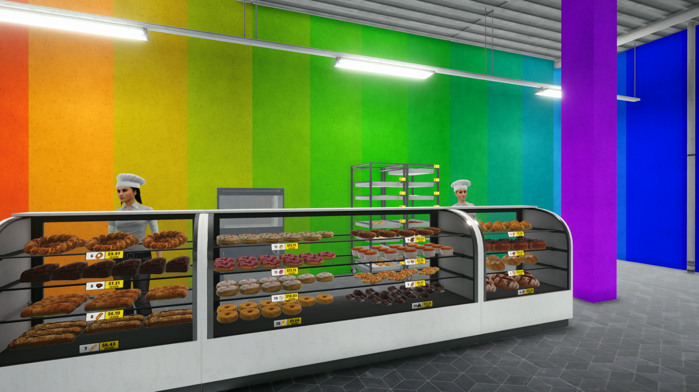
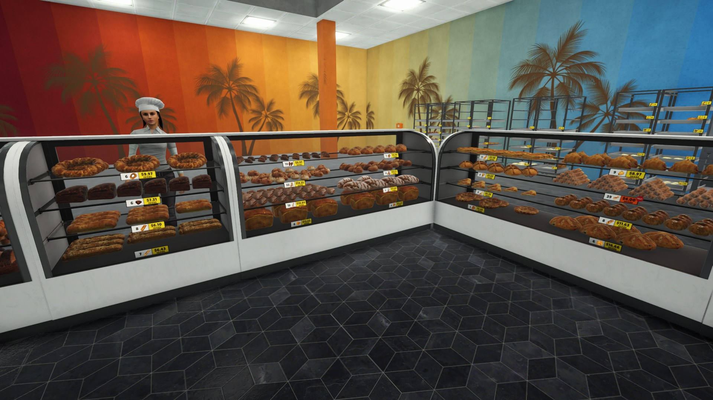
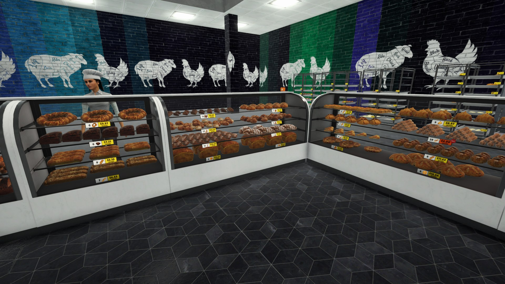
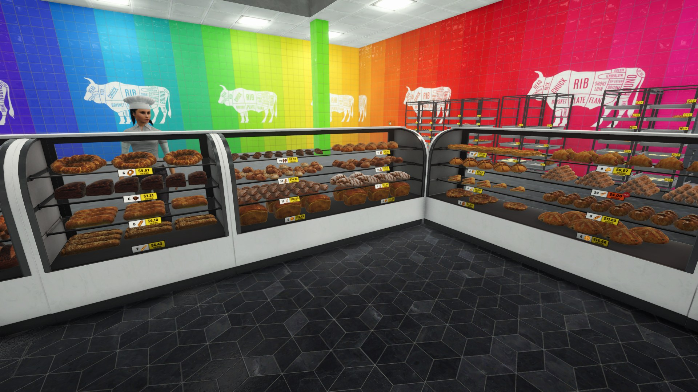
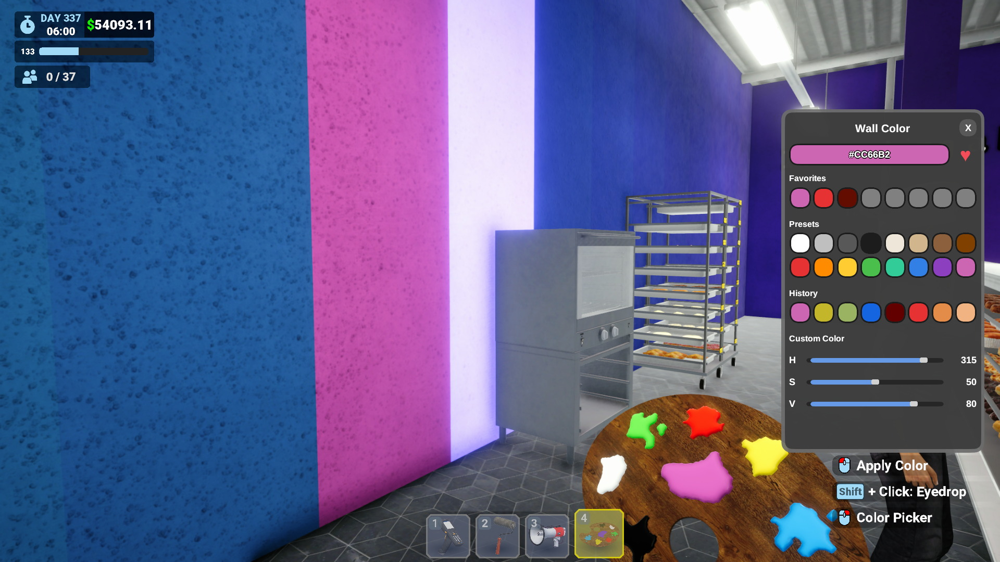
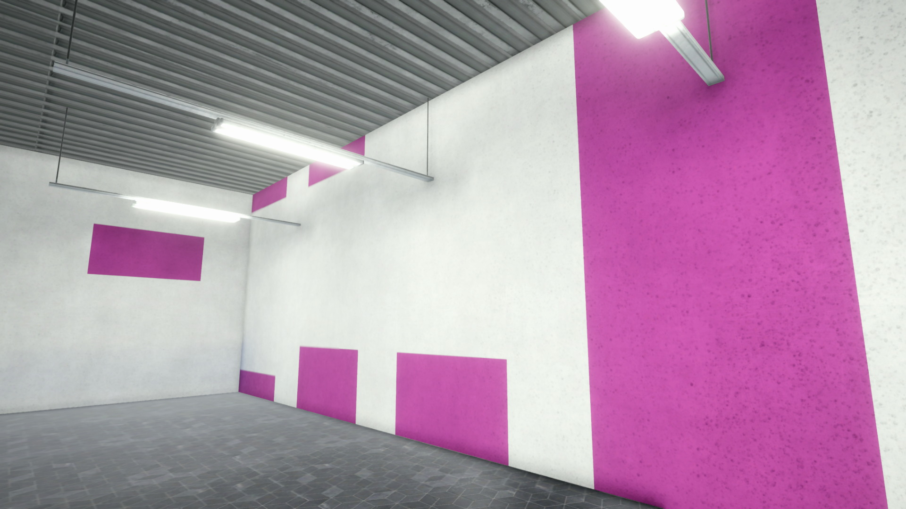

  

A Megastore Simulator mod that lets you recolor **every wall in the game** — any color, any time, no cost — plus three new wall shapes of its own.

  

## What it adds

**The Palette** — a new hotbar tool in slot **5** (hotkey **5**). Point it at any vanilla wall and recolor it instantly: no paint cost, no paint-roller animation, just pick a color and click. The wall stays exactly what it was — same pattern, same shape — only the color changes.

- Solid-color walls get a clean full-color repaint.
- The vanilla two-tone walls get their accent band recolored — the band line stays exactly where vanilla puts it.
- Patterned walls (brick, tile, wallpaper) keep their pattern, shifted to your color — grout and mortar keep their original look. (Prefer a flat repaint over the pattern? Flip the `PatternedRecolorMode` config to **Replace**.)
- The decal walls (Red Beef Tiles, Black Meat Brick, Summer Palm) get their **base** recolored while the artwork stays pixel-perfect vanilla.
- The Toy Speckle Wall is the one wall the palette won't touch — its rainbow doesn't mix with recoloring.

*Coming from 1.x?* The old Repainted! Full Color and Low Stripe shop walls are gone — you now just recolor the vanilla solid and two-tone walls directly. Everything you painted before still looks the same.

  

  

  

  

**3 new wall shapes**, sold in their own rainbow **Repainted!** tab on the management screen (1000 each):

- **Repainted! Stripe + Trim** — a low stripe plus a top trim.
- **Repainted! Trim** — a low and top trim.
- **Repainted! High Stripe** — a colored band across the upper section of the wall.

They paint in your currently selected palette color, and you can recolor them again any time.

  

## Usage

1. Switch to the **Palette** tool and point it at any wall:
   - **Left click** — repaint the wall in the currently selected color.
   - **Right click** — open the color picker to choose a new color.
   - **Shift + left click** — eyedropper: copy the color from whatever wall you're pointing at.
2. For the new shapes: buy a **Repainted!** wall from the Repainted! tab on the management screen and apply it with the paint roller, exactly like any other wallpaper — it paints in your palette color.
3. To change a wall's *shape*, paint it with a different wall from the shop; to change its *color*, use the palette.

Painting over any recolored wall with the vanilla roller returns it to a normal vanilla wall.

## Installation

**Requires Tobey's [BepInEx Pack for Megastore Simulator](https://www.nexusmods.com/megastoresimulator/mods/2)** 

1. Install Tobey's BepInEx pack into your Megastore Simulator folder per its own instructions, then launch the game once so it can generate its folder structure.
2. Download the latest `Repainted-v*.zip` from the [Releases](../../releases) page.
3. Extract `Repainted.dll` into `Megastore Simulator/BepInEx/plugins/` — that single file is the whole mod.
   (Updating from 1.x: delete the old `BepInEx/plugins/Repainted/` folder, including `repainted_palette`, first.)
4. Launch the game.

## Uninstallation

Delete `Repainted.dll` from `BepInEx/plugins/`. Every wall reverts to its true vanilla state: palette-recolored walls go back to the wall underneath, and tiles painted with a Repainted! shape revert to the default wall.

Your saved color data is kept in `BepInEx/config/` in case you reinstall later. Delete the Repainted files there too if you want to wipe all saved walls and settings.

## License

Code and authored assets: **MIT** (see `LICENSE`). The palette 3D model is an original work released under **CC0-1.0** — see `NOTICE.md`. No third-party licensed assets.

## Credits

Built with [BepInEx](https://github.com/BepInEx/BepInEx) and [Harmony](https://github.com/pardeike/Harmony).

Megastore Simulator is a game by Yolo Games Studio. This mod is unofficial and not affiliated with or endorsed by the developer.
